# Tutorial

This page walks through a complete RadQC session: launching, configuring a project, annotating images, and locating the output file.

## Launching

After installing RadQC, launch the application. The landing screen presents two cards: one to start a fresh session, one to resume an existing project.

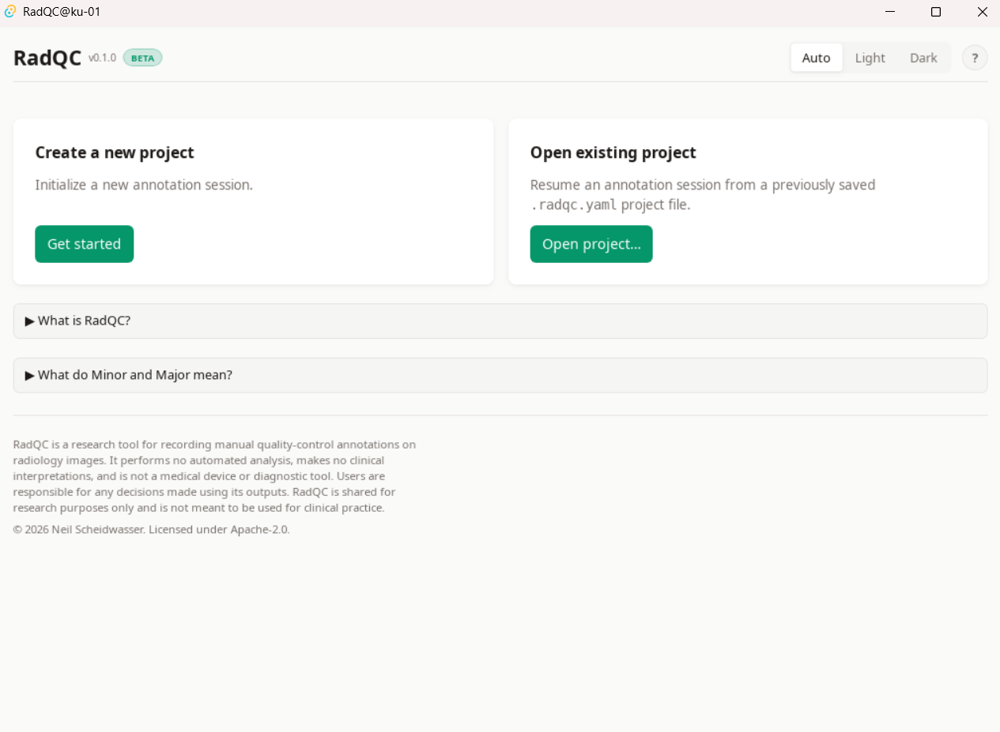

The top-right corner offers two controls available throughout the app:

- The **theme toggle** (Auto / Light / Dark) — choose how the UI is themed; *Auto* follows your system preference.
- The **help button (?)** — opens an *About* popover with version information, license, and links to the GitHub repository and issue tracker.

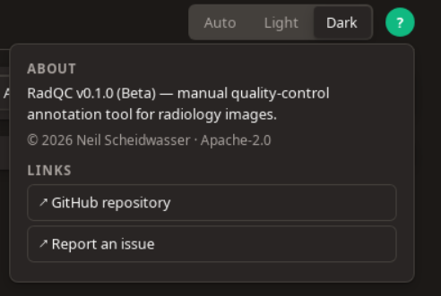

## Create a new project

1. Click **Get started** on the "Create a new project" card.
2. Enter a **reviewer ID** (your initials or any identifier) and a **project name**.
3. Click **Select folder…** under *Image folder* and choose the directory containing the images to review (PNG and JPEG are supported). Subdirectories are walked recursively.
4. Optionally pick a different **output folder** under *Output folder* (defaults to the image folder).
5. Click **Start annotating**.

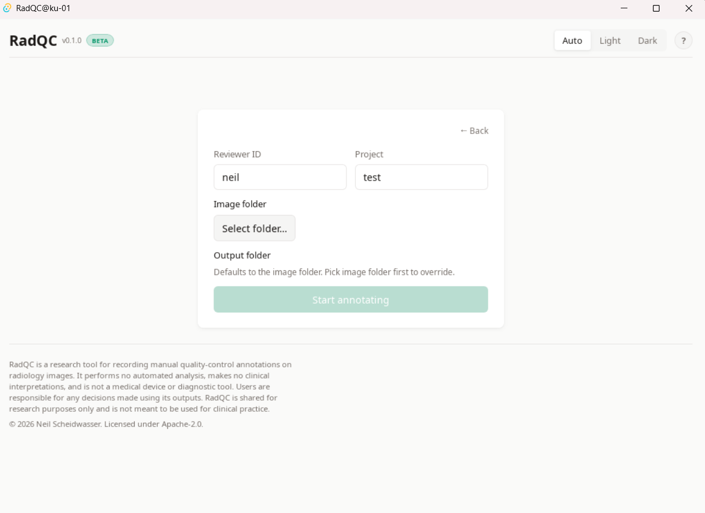

## Open an existing project

To continue an earlier session:

1. Click **Open project…** on the "Open existing project" card.
2. Select the `.radqc.yaml` project file from a previous session.
3. The application loads the existing annotations and resumes where you left off.

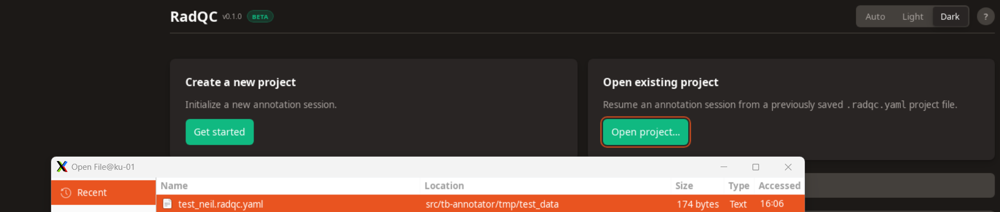

## Annotating an image

For each visible image:

- Pick a flag: **Minor** (usable but with a noted quality issue) or **Major** (unsuitable for use).
- Leave both fields empty to skip an image.

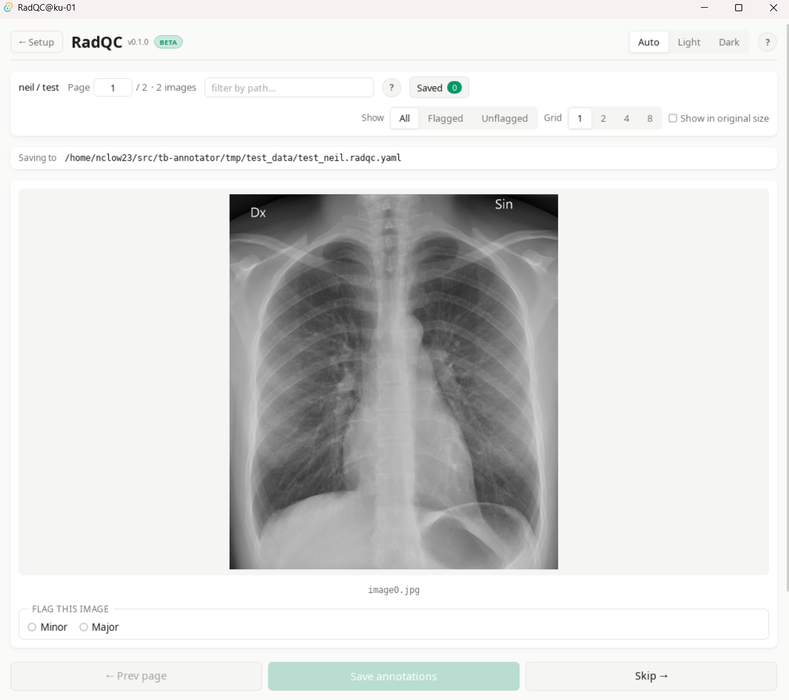

When you select a flag, a **Reason** textarea appears. Provide a short description of the quality issue. The reason is required when a flag is set.

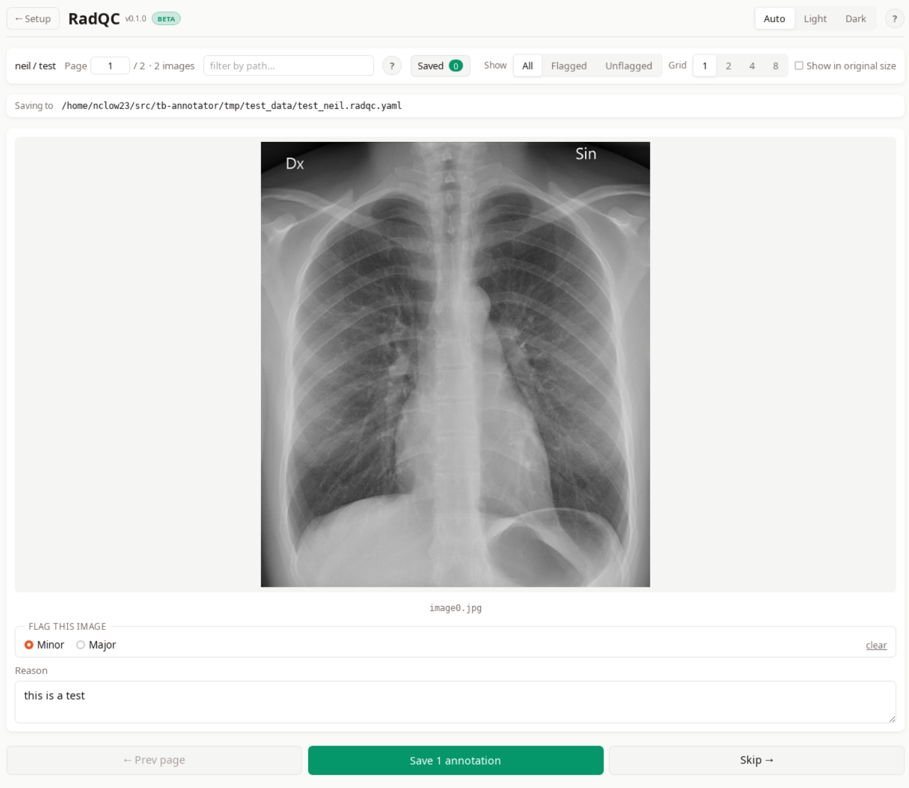

If you're unsure what *Minor* and *Major* mean, click the **?** icon in the meta bar for short definitions.

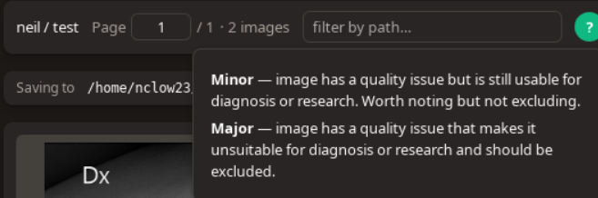

## Saving

Click **Save N annotations** to write the page's annotations to the YAML file and advance to the next page. Saved images are marked with a confirmation tag.

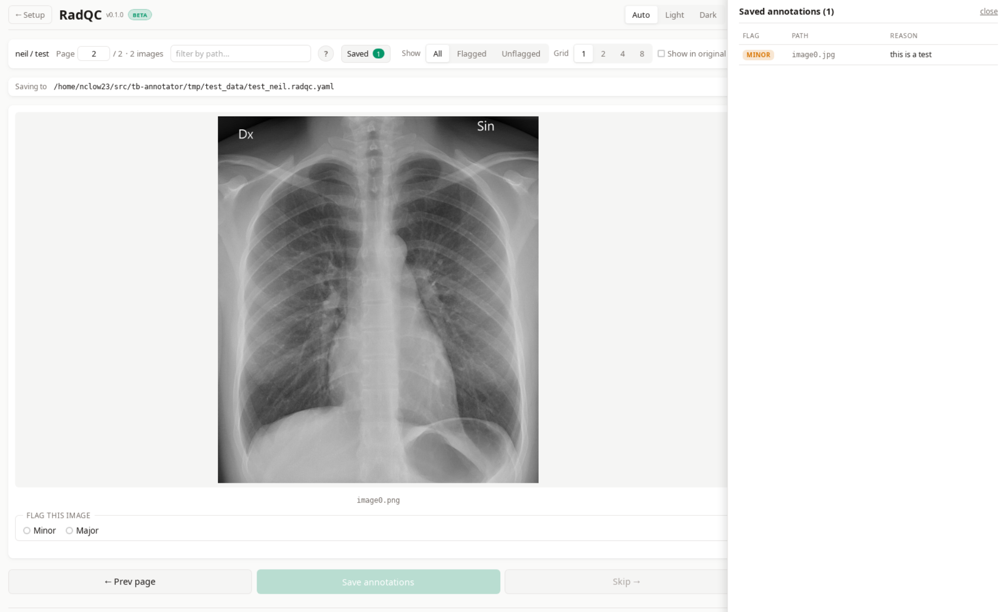

## Additional controls

### Grid size

View 1, 2, 4, or 8 images per page.

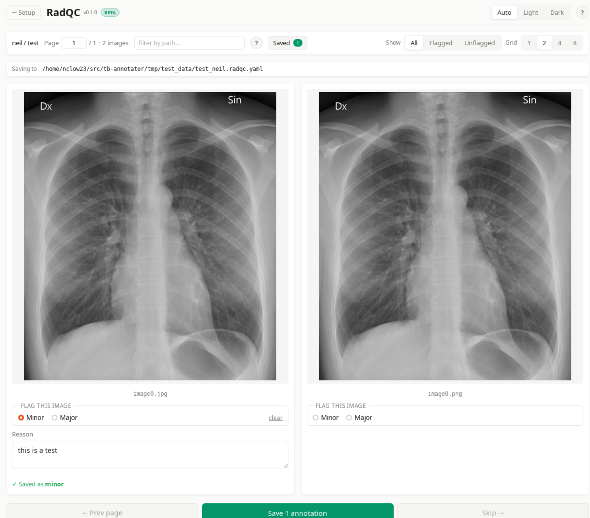

### Filter

Restrict the visible list to *All*, *Flagged*, or *Unflagged* images. Useful for reviewing or re-checking only the images you have already flagged.

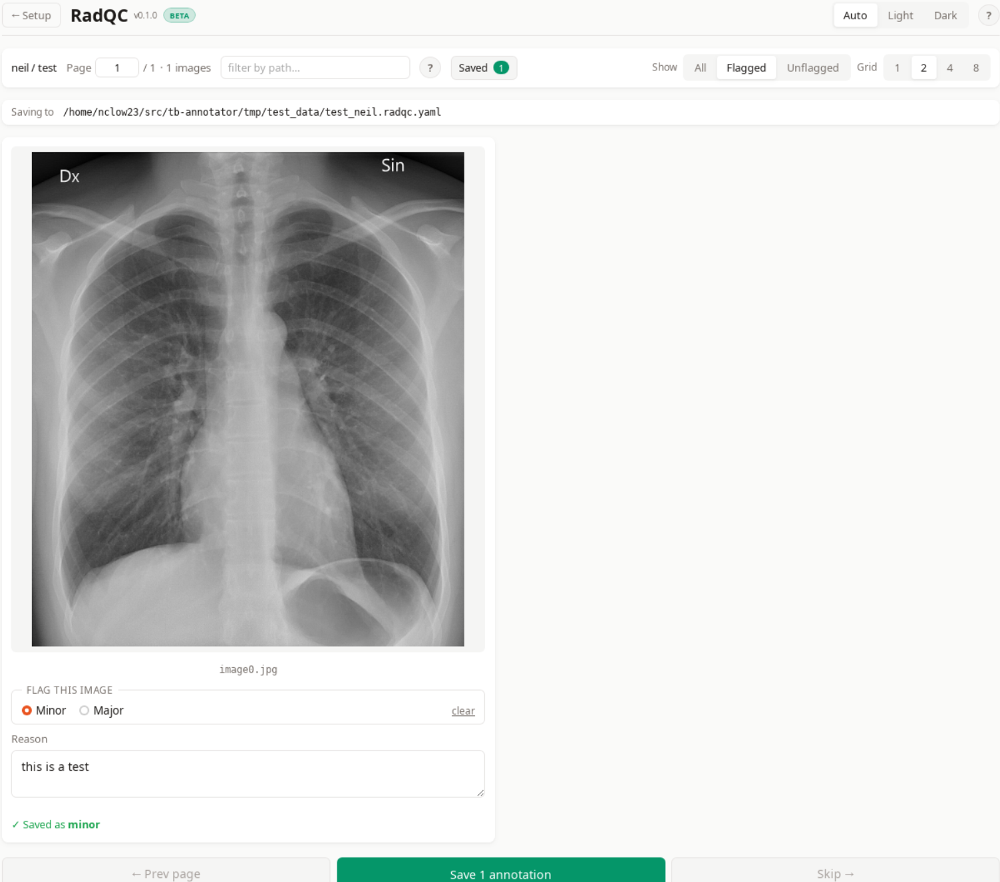

### Path search

Type a substring of an image path to narrow the visible list. Combines with the *Filter* setting.

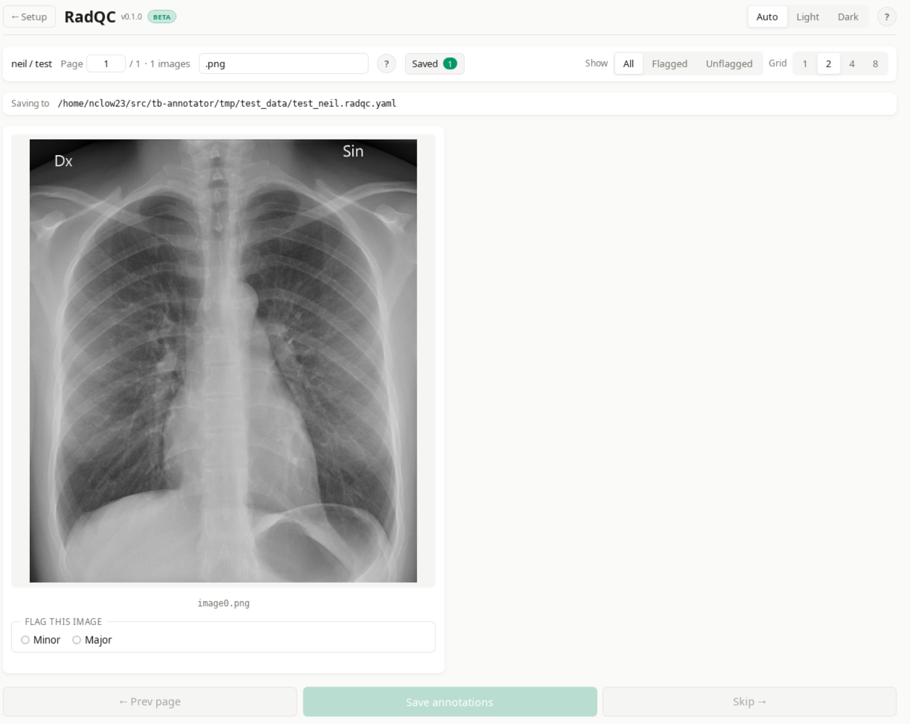

### Other

- **Show in original size** — display the image at its intrinsic pixel size (single-image mode only).
- **Page jump** — type a page number into the page counter to navigate directly.
- **Saved side panel** — table view of every saved annotation; clicking a row jumps to that image.

## The output file

Annotations are written to a single YAML file at `{output_folder}/{project}_{reviewer}.radqc.yaml`:

```yaml
radqc: 0.1.0
reviewer: neil
project: default
image_dir: /path/to/your/images
annotations:
  patient_001.png:
    severity: minor
    reason: slight rotation
  patient_007.png:
    severity: major
    reason: severe motion blur
```

Each save rewrites the file atomically (temp file + rename), so an interrupted save cannot corrupt the data. Re-annotating an image overwrites its previous entry; no history is retained.

!!! tip "Sharing or analysing the output"
    The YAML file is plain text and self-describing. It can be opened in any text editor, parsed by any YAML library (`pyyaml` in Python, `serde_yaml` in Rust, `js-yaml` in JavaScript, etc.), or shared with collaborators alongside the image folder.
